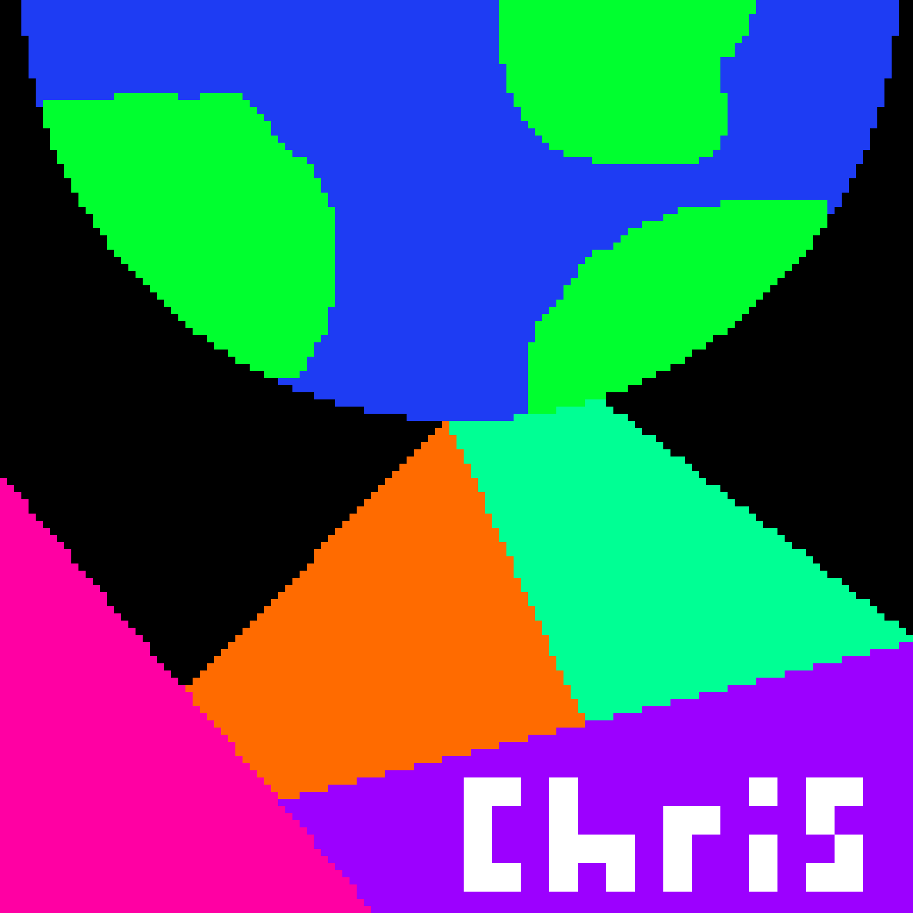

# Christopher Lamers

</img>
🇨🇦 | Persuing university education this fall
  📚 | Interested in compiler design, networking, asynchronus IO
  📝 | Mainly use [Visual Studio Code](https://code.visualstudio.com/) and
[Github Desktop](https://github.com/shiftkey/desktop/) for daily developer
workflow; daily driving [PopOS](https://pop.system76.com/)
  💻 | Love using Deno and C#; working towards learning
[Rust](https://www.rust-lang.org/)
 

---

### Projects I am working on ~

> 🟩 Core Team, [Lydo Programming Language](https://github.com/lydo-lang/)
